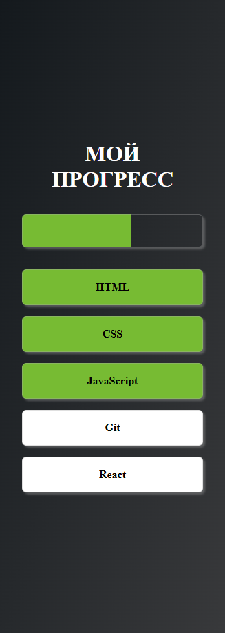

# FreeCoursesClosing

## HTML-CSS

1. [Task 1](https://brainfixer-resultschool.github.io/FreeCoursesClosing/HTML-CSS/1/)

   

   Задание:

   Сверстать блок, изображенный на рисунке 1_1.

   Требования:

   1.1 Использовать исключительно HTML и CSS.

   1.2 Не использовать изображения (ни в теге img, ни в свойстве background-image/background).

   1.3 Букву R выполнить ссылкой, ведущей на сайт https://result.school.

   1.4 Блок должен занимать 70-80 процентов от минимального размера вьюпорта и располагаться строго по его середине.

   1.5 Блок должен быть "резиновым", пропорционально изменяя свои размеры при изменении размеров окна браузера.

   1.6 При наведении на букву R она должна изменять цвет и слегка масштабироваться, как на рисунке 1_2. Изменения должны происходить плавно.

   

2. [Task 2](https://brainfixer-resultschool.github.io/FreeCoursesClosing/HTML-CSS/2/)

   

   Задание:

   Сверстать одностраничное приложение, изображенное на рисунке 2_1.

   Требования:

   2.1 Использовать исключительно HTML и CSS (без Javascript).

   2.2 При нажатии кнопок ширина верхней полосы прогресса должна меняться по принципу: нажата первая кнопка - ширина полосы 20%, нажата вторая - 40% и т.д. до пятой, при нажатии которой ширина полосы прогресса увеличивается до 100%. Цвет фона кнопок до нажатой и её включительно также должен меняться. Принцип работы показан на рисунках 2_2 и 2_3. Изменение ширины блоков полосы прогресса должно происходить плавно.

   
   

   2.3 Блоки должны располагаться строго по середине вьюпорта.

   2.4 Приложение должно быть "резиновым" и пропорционально менять размеры при изменении ширины вьюпорта. Кроме того, приложение должно быть адаптивным. При разрешении меньше 600 пикселей кнопки должны становиться вертикально.

   

   2.5 При наведении на кнопки мышки цвет их фона должен меняться. Изменения должны происходить плавно.

3. [Task 3](https://brainfixer-resultschool.github.io/FreeCoursesClosing/HTML-CSS/3/)

   

   Задание:

   Сверстать одностраничное приложение, изображенное на рисунке 3_1.

   Требования:

   3.1 Использовать исключительно HTML и CSS (без Javascript).

   3.2 Карточка представляет собой двухсторонний блок. При наведении мышки на её лицевую сторону карточка должна плавно перевернуться вокруг вертикальной оси и показать свою оборотную сторону.

   

   3.3 На обратной стороне карточки располагаются три переключающихся вкладки. При нажатии на вкладку она должна активироваться - менять цвет и включать соответствующий вкладке текстовый блок. Изменение цвет и переключение блоков должно быть плавным.

   
   

   3.4 Карточка должна располагаться строго посередине вьюпорта.

   3.5 Приложение должно быть "резиновым" и пропорционально менять размеры при изменении ширины вьюпорта.

## Marathon

1. [Task 1]
2. [Task 2]
3. [Task 3]
